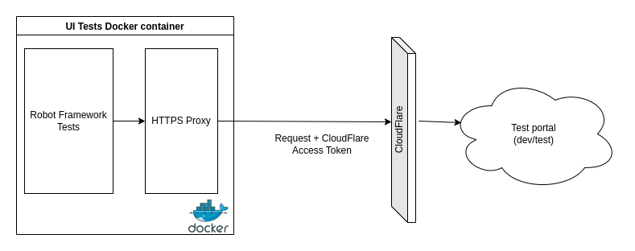

# SKYSQL UI Test Automation

## Description:

#### This repository hold our automated UI tests and configurations.

#### The test suites are executed using the open source automation framework called *ROBOT FRAMEWORK*

## _HOW TO USE:_

We already have a docker image of the robot framework with all dependencies in our repository mariadb/cpe-tests.
To download the image execute:
```        
docker pull mariadb/cpe-test:robo-frame-dev8
```
 Execute test suite by folder:
 1. Clone the current repository
 2. Run command :

        docker run \
        -v <local path to the reports' folder>:/opt/robotframework/reports:Z \
        -v <local path to the test suites' folder>:/opt/robotframework/tests:Z \
        mariadb/cpe-test:robo-frame-dev8

 By running the above command all test suites found in the provided folder will be executed.
 The local folder which will hold the reports will be created automatically if it doesn't exist.


OPTIONAL VARIABLES:
There are couple of optional variables available to the user:

        BROWSER (chrome or firefox)
        SCREEN_COLOUR_DEPTH (default: 24)
        SCREEN_HEIGHT (default: 1080)
        SCREEN_WIDTH (default: 1920)
        ROBOT_REPORTS_DIR (default: /opt/robotframework/reports)
        ROBOT_TESTS_DIR (default: /opt/robotframework/tests)
        ROBOT_THREADS (default: 1)
        ROBOT_OPTIONS (support for --exclude, --variable, --test, --suite)
        HTTPS_PROXY (e.g. "https://127.0.0.1:9999")
        CF_ACCESS_CLIENT_ID (CloudFlare token client ID)
        CF_ACCESS_CLIENT_SECRET (Cloudflare token client secret)

## Cloudflare proxy configuration
One option to pass through Cloudflare wall, to access the dev/test portal (https://cloud.dev.mariadb.net  and https://cloud.test.mariadb.net respectively), is to interactively use Cloudflare WARP (as explained in the  Confluence article [Cloudflare WARP](https://mariadbcorp.atlassian.net/wiki/spaces/HELPDESK/pages/1670348830/Cloudflare+Warp)).

As the tests run automatically from within the Docker image, on various platform, a different method of authentication is used, as explained at [Configuring Token Authentication](https://support.cloudflare.com/hc/en-us/articles/115001376488-Configuring-Token-Authentication). However, in order to use token authentication, both the client ID and client secret token should be attached as headers to every outgoing requests.
In order to achieve that an HTTP proxy is dynamically started inside the Docker container. The proxy used is the free and open source interactive HTTPS proxy, [mitmproxy](https://mitmproxy.org/) (a.k.a. man-in-the-middle-proxy). It simulates a trusted certificate authority, in order to delegate secure HTTPS requests, hence it can modify every incoming request (e.g. to append headers, although there may be future uses for its presence too). It's easy to spin-up, and easy to extend and customize with Python scripts.

In order to use the proxy, and to go through the Cloudflare authentication:

 1. Add the `HTTPS_PROXY` environment variable to the `docker run` command.     
 Basically the proxy runs locally inside the container, hence its address is 127.0.0.1, but theoretically can be running in a different container/environment, hence a different address can be used.     
 In order not to collide with other internal ports, `9999` is given as a possible option. Of course, any port can be used.    
 To use the proxy setting, append the `docker run` command line with the variable, in the following format:     

        -e HTTPS_PROXY="https://127.0.0.1:9999"


2. Add the `CF_ACCESS_CLIENT_ID` (CloudFlare token client ID) and `CF_ACCESS_CLIENT_SECRET` (Cloudflare token client secret) environment variables to the `docker run` command.    
The token credentials are used as a Github Workflow Secrets, stored in the [skysql-microservices-infra](https://github.com/mariadb-corporation/skysql-microservices-infra) repos as `CF_ACCESS_CLIENT_ID` and `CF_ACCESS_CLIENT_SECRET`.      
They can be found in the [1-password](https://mariadb.1password.com/) vault `CPE-SRE-Shared`, under the name `Cloudflare SkySQL UI Tests Auth Token`.    
If you require a new token, open a request at [MariaDB Helpdesk](https://mariadbcorp.atlassian.net/servicedesk/customer/portal/1/group/1/create/23).

**Note:** The `HTTPS_PROXY` variable is not arbitrary, and does affect the way networking is handled within the container. See the official Docker docs, [Configure Docker to use a proxy server](https://docs.docker.com/network/proxy/#use-environment-variables).




### EXAMPLES:

1. Example - run test from argument file.

        docker run \
        -v <local path to the reports' folder>:/opt/robotframework/reports:Z \
        -v <local path to the repository' folder>:/opt/robotframework/skysql-qe-ui-tests:Z \
        -v <local path to the config' folder>:/opt/robotframework/skysql-qe-ui-tests/Config:Z\
        -e BROWSER=chrome \
        -e ROBOT_TESTS_DIR=/opt/robotframework/skysql-qe-ui-tests/Tests/ \
        -e ROBOT_OPTIONS="--argumentfile /opt/robotframework/skysql-qe-ui-tests/Config/Login_default.args --variable USERNAME:<username> --variable PASSWORD:<password> --variable ENV:<env> --variable BROWSER:chrome --variable SCREEN_WIDTH:<set your screen width> --variable SCREEN_HEIGHT:<set your screen height> --variable IP_ADDRESS:<ip_address>" \
        mariadb/cpe-test:robo-frame-dev8

The above command will execute test suites defined in the argument file Login_default.args

2. Example - run particular test suites

        docker run \
        -v <local path to the reports' folder>:/opt/robotframework/reports:Z \
        -v <local path to the repository' folder>:/opt/robotframework/skysql-qe-ui-tests:Z \
        -e BROWSER=firefox \
        -e ROBOT_TESTS_DIR=/opt/robotframework/skysql-qe-ui-tests/Tests/ \
        -e ROBOT_OPTIONS="--suite LoginTests --variable USERNAME:<username> --variable PASSWORD:<password> --variable ENV:<env> --variable IP_ADDRESS:<ip_address>" --variable BROWSER:firefox --variable SCREEN_WIDTH:<set your screen width> --variable SCREEN_HEIGHT:<set your screen height> \
        mariadb/cpe-test:robo-frame-dev8
The above command will execute LoginTests suite.

3. Example: Build and run locally:
        Get the repo, and run `docker build` to build a local docker image with a locally chosen tag:    

        docker build -t local_ui_tests .

   Then run the locally built image with `docker run`. In this example, a proxy server is used with Cloudflare credentials:

        docker run \
        -v "$PWD/reports":/opt/robotframework/reports:Z \
        -v "$PWD":/opt/robotframework/skysql-qe-ui-tests:Z \
        -v "$PWD/Resources/Config/CRUDTopologiesConfigs/":/opt/robotframework/skysql-qe-ui-tests/Config:Z \
        -e BROWSER=chrome \
        -e ROBOT_TESTS_DIR=/opt/robotframework/skysql-qe-ui-tests/Tests/ \
        -e HTTPS_PROXY="https://127.0.0.1:9999"  \
        -e CF_ACCESS_CLIENT_ID="<cloudflare access id>" \
        -e CF_ACCESS_CLIENT_SECRET="<cloudflare access secret>" \
        -e ROBOT_OPTIONS="--argumentfile /opt/robotframework/skysql-qe-ui-tests/Config/GCP_Standalone_default.args --test StandaloneCRUD --variable USERNAME:<username> --variable PASSWORD:<password> --variable ENV:test --variable BROWSER:chrome --variable SCREEN_WIDTH:<set your screen width> --variable SCREEN_HEIGHT:<set your screen height> --variable IP_ADDRESS:<ip_address>" \
        local_ui_tests

### Building and pushing a new version to Docker
In order to publish a new version of the docker image, in the [mariadb/cpe-test](https://hub.docker.com/repository/docker/mariadb/cpe-test) dockerhub repo:   

First build the image locally, with the appropriate tag:
```
docker build -t mariadb/cpe-test:robo-frame-dev8 .
```

Make sure you are logged in to dockerhub
```
docker login
```

Then push the image to dockerhub, using the same tag with which it was built:
```
docker push mariadb/cpe-test:robo-frame-dev8
```

### Additional information

If for some reason you don't like to use the already available docker image you can follow the steps bellow and install all the tools and dependencies required to run the framework locally on your machine.

#### Local Setup (New)

1. Install Python 3 based on your OS: <https://realpython.com/installing-python/>
1. Make sure you have pip installed: <https://docs.python.org/3/library/ensurepip.html>
1. Create and activate a virtual environment:

    ```shell
    python -m venv .venv
    source .venv/bin/activate
    ```

1. Install all the dependencies:

    ```shell
    pip install robotframework
    pip install robotframework-seleniumlibrary
    pip install robotframework-browser
    pip install robotframework-requests
    pip install robotframework-xvfb
    pip install robotframework-excellib
    pip install axe-selenium-python
    pip install PyYAML
    ```

1. If using Visual Studio Code or PyCharm, [there are extensions available](https://docs.robotframework.org/docs/getting_started/ide) to assist you with the development.

1. Run the tests from the command line:

    BROWSER variable can be: `chrome` or `firefox`.  
    ENV variable can be: `test` or `prod`.  
    USERNAME variable is the email address used to log into the SkySQL Customer Portal.  
    PASSWORD variable is the password used to log into the SkySQL Customer Portal.

    ```shell
    # To run a test suite, for example the LoginTests suite:
    robot --suite LoginTests --variable BROWSER:firefox --variable SCREEN_WIDTH:2560 --variable SCREEN_HEIGHT:1600 --variable ENV:test \
      --variable 'USERNAME:<your-email>' --variable 'PASSWORD:<your-password>' \
      ./Tests

    # To run a single test file:
    robot --variable BROWSER:firefox --variable SCREEN_WIDTH:2560 --variable SCREEN_HEIGHT:1600 --variable ENV:test \
      --variable 'USERNAME:<your-email>' --variable 'PASSWORD:<your-password>' \
      ./Tests/CustomerPortalTests/ConfigManagerTests/AccessConfigurationManagerUI.robot 
    ```

#### Installation Guide (Old)

1. Install Python 3 based on your OS
https://realpython.com/installing-python/

2. Set your paths MacOS & Linux OS:
https://www.tutorialspoint.com/robot_framework/robot_framework_unix_linux_installation.htm
    
    For Windows OS: 
   - Verify python directories are in PATH https://robotframework.org/robotframework/latest/RobotFrameworkUserGuide.html#configuring-path
   - Also check 'pip3' version https://robotframework.org/robotframework/latest/RobotFrameworkUserGuide.html#installing-using-pip

3. Install robotframework
https://robotframework.org/robotframework/latest/RobotFrameworkUserGuide.html#installation-instructions

4. Install Selenium library and browsers' drivers
https://robotframework.org/SeleniumLibrary/#browser-drivers

P.S. You can use the following commands to download the corresponding webdriver manager version for your browser version:
```
pip3 install --upgrade --user webdrivermanager
webdrivermanager <browser> --linkpath <path>
```
Example for MacOS & Linux OS: webdrivermanager chrome --linkpath /usr/local/bin

Example for Windows OS: webdrivermanager chrome --linkpath C:\bin

5. Install MariaDB Connector/C
for MacOS:
```
brew install mariadb-connector-c
```
for Linux:
```
sudo apt-get install libmariadb-dev
```
for Windows:
https://mariadb.com/docs/skysql-previous-release/connect/programming-languages/c/install/

6. Install the following additional libraries:

***Important Note**   It is highly recommended to use a virtualenv /_venv_, _pyenv_ or other/. Full set of packages needed for new virtualenv:
```
pip3 install --upgrade --user robotframework
```
```
pip3 install --upgrade --user robotframework-seleniumlibrary
```
```
pip3 install --upgrade --user robotframework-excellib
```
```
pip3 install --upgrade --user mysql-connector-python
```
```
pip3 install --upgrade --user robotframework-stringformat
```
```
pip3 install --upgrade --user robotframework-python3
```
```
pip3 install --upgrade --user mysql
```
```
pip3 install --upgrade --user mysqlclient
```
```
pip3 install --upgrade --user mariadb
```

7. If using PyCharm or IntelliJ IDEA, worth it to download this plugin and install it via 'Install plugin from disk'.
It will allow you to jump into the source code of the library keywords and will show you the usages of a keyword.
https://github.com/lte2000/intellibot/blob/master/intellibot.jar
P.S. Update the plugin to the latest version after downloading.

8. Run the tests from Command Line Interface
Depending on the topology should be changed the example_default.args file and the exampleCreateConnectQueryDelete.robot 
file, where the example_default.args could be Standalone_default.args or any other .args file and 
exampleCreateConnectQueryDelete.robot could be StandaloneCreateConnectQueryDelete.robot file or any other test file.
Browser variable can be: `chrome` or `firefox`.
Environment variable can be: `test`, `staging` .
Username variable is the email address used to login in the SkySQL Customer Portal.
Password variable is the password used to login in the SkySQL Customer Portal.
IP address variable is the one you are currently using in your network.

```
robot --variable BROWSER:<browser> --variable SCREEN_WIDTH:<set your screen width> --variable SCREEN_HEIGHT:<set your screen height> --variable ENV:<env> --variable USERNAME:<username> --variable PASSWORD:<password> --variable IP_ADDRESS:<ip_address> 
--argumentfile <local path to your project>/skysql-qe-ui-tests/Resources/Config/example_default.args 
-d results Tests/CustomerPortalTests/exampleCreateConnectQueryDelete.robot
```


## Automated scheduled tests configuration
The file [automated-runs-config.json](https://github.com/mariadb-corporation/skysql-qe-ui-tests/blob/master/Resources/Config/ScheduledTests/automated-runs-config.json) is a configuration file used for automated scheduled runs of UI tests.

The [Trigger Jenkins build with Parameters](https://github.com/mariadb-corporation/skysql-microservices-infra/actions/workflows/trigger-jenkins-build.yml) Github Actions workflow in the [skysql-microservices-infra](https://github.com/mariadb-corporation/skysql-microservices-infra) repo ([see the yml file](https://github.com/mariadb-corporation/skysql-microservices-infra/blob/develop/.github/workflows/trigger-jenkins-build.yml)) is used to trigger UI tests on Jenkins.

It has a number of trigger options:

* Manual trigger, where all parameters are manually set.
* Implicit trigger upon merge into the `develop` branch of the skysql-microservices-infra repo, with default hardcoded parameters.
* Scheduled execution upon intervals.

Scheduled execution is triggered by the Github workflow's CRON, and at the moment is scheduled to run the workflow every 3 hours, from Monday to Friday, starting at Monday midnight.

Every scheduled execution goes through the configurations listed in [automated-runs-config.json](https://github.com/mariadb-corporation/skysql-qe-ui-tests/blob/master/Resources/Config/ScheduledTests/automated-runs-config.json), and picks the relevant one in a repeating modulo cycle. Each configuration item contains the following values for configuring the scheduled run:

* **Index**    
  A unique number for this configuration entry.    
  Numbers don't have to be consequent, they are used to identify the item later in logs.

* **CLOUD_ENV**     
  The cloud to run the tests against. `GCP` or `AWS`.

* **TEST_PLAN**    
  The name of the test plan to run (Denotes the tests folder. E.g. `CustomerPortalTests`)

* **TEST_SUITE**    
  The type of the test plan to run (Denotes the tests subfolder. E.g. `CRUDTopologiesTests`)

* **TEST**    
  The test to run (Denotes the specific test case name in a .robot file. E.g. `StandaloneCRUD`)

* **ARGS_FILE**    
  Arguments file to use for the test (Points to the args file name. E.g. `GCP_Standalone_default`)

* **CUSTOM_ARGS**    
  Arguments listed here will override the ones in the args file. You need to specify only the overriding ones, not all of the required args (E.g. `--variable REGION:us-west2` to override just the region).


* **DISABLED**    
  Specifies if this test configuration is disabled, in which case it will be skipped in the scheduled cycle. Values are `true` (disabled) or `false` (enabled).
